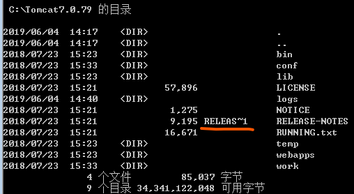
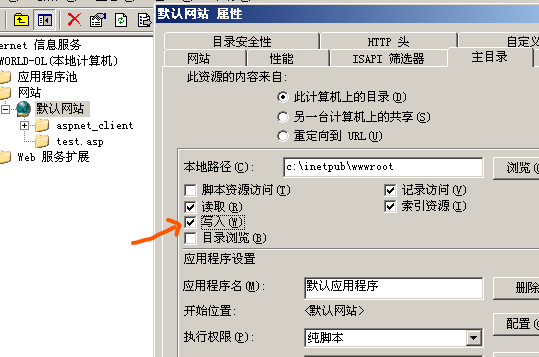

# 中间件漏洞总结报告

## 0x01-IIS漏洞分析

- IIS（互联网信息服务）是Internet Information Services的缩写，是由微软公司提供的基于运行Microsoft Windows的互联网基本服务。最初是Windows NT版本的可选包，随后内置在Windows 2000、Windows XP Professional和Windows Server 2003一起发行，但在Windows XP Home版本上并没有IIS。IIS是一种Web（网页）服务组件，其中包括Web服务器、FTP服务器、NNTP服务器和SMTP服务器，分别用于网页浏览、文件传输、新闻服务和邮件发送等方面，它使得在网络（包括互联网和局域网）上发布信息成了一件很容易的事。


- IIS的安全脆弱性曾长时间被业内诟病，一旦IIS出现远程执行漏洞威胁将会非常严重。远程执行代码漏洞存在于 HTTP 协议堆栈 (HTTP.sys) 中，当 HTTP.sys 未正确分析经特殊设计的 HTTP 请求时会导致此漏洞。 成功利用此漏洞的攻击者可以在系统帐户的上下文中执行任意代码，可以导致IIS服务器所在机器蓝屏或读取其内存中的机密数据。


### 1.短文件名

**成因**

- 为了兼容16位MS-DOS程序，Windows为文件名较长的文件（和文件夹）生成了对应的windows 8.3 短文件名。 在Windows下查看对应的短文件名，可以使用命令`dir /x`。
- 只有前六位字符直接显示，后续字符用~1指代。其中数字1还可以递增，如果存在多个文件名类似的文件（名称前6位必须相同，且后缀名前3位必须相同）。后缀名最长只有3位，多余的被截断。

 

**复现**

1. 创建`aaaaaaaaa.html`文件

2. 猜解过程：

   `http://x.x.x.x/A*~1****/a.aspx`	404

   `http://x.x.x.x/B*~1****/a.aspx`	400

   `http://x.x.x.x/AAAAAA~1****/a.aspx`	404

   `http://x.x.x.x/AAAAAA~1/a.aspx`（判断是否是文件夹）	配置不可查看

   `http://x.x.x.x/AAAAAAA~1*A**/a.aspx`	400

   `http://x.x.x.x/AAAAAAA~1*H**/a.aspx`	404

   `http://x.x.x.x/AAAAAA~1.HTM/a.aspx`	404

- 访问构造的某个存在的短文件名，会返回404。

  访问构造的某个不存在的短文件名，返回400。
- 检查工具：https://github.com/lijiejie/IIS_shortname_Scanner

**修复**

- 升级`.net framework`
- 修改注册表：`HKEY_LOCAL_MACHINE\SYSTEM\CurrentControlSet\Control\FileSystem`修改`NtfsDisable8dot3NameCreation`为1，重启，将web文件夹的内容拷贝到另一个位置，如c:\www到d:\w,然后删除原文件夹，再重命名d:\w到c:\www
- CMD关闭NTFS 8.3文件格式的支持

**局限**

- 此漏洞只能确定前6个字符，如果后面的字符太长、包含特殊字符，很难猜解；


- 如果文件名本身太短（无短文件名）也是无法猜解的；

- 如果文件名前6位带空格，8.3格式的短文件名会补进，和真实文件名不匹配；

### 2.PUT漏洞

**成因**

- IIS Server 在 Web 服务扩展中开启了 WebDAV ，配置了可以写入的权限，造成任意文件上传。版本： IIS6.0

- WebDAV是一种基于 HTTP 1.1协议的通信协议，它扩展了HTTP 1.1，在GET、POST、HEAD等几个HTTP标准方法以外添加了一些新的方法。使应用程序可直接对Web Server直接读写，并支持写文件锁定(Locking)及解锁(Unlock)，还可以支持文件的版本控制。

  IIS实现WebDAV是采用它的两种接口：CGI、ISAPI的ISAPI接口。

  WebDAV支持的请求包括PROPFIND、PROPPATCH、MKCOL、DELETE、PUT、COPY、MOVE、LOCK、UNLOCK等。

**复现**

- 前提：开启WebDAV 、写入权限、脚本资源访问




- 将GET请求改为OPTIONS，可以查看服务器信息。（启用了“WebDAV”扩展）


- 此时可以用PUT上传文件，但是不可以直接上传可执行脚本文件。（启用了“WebDAV”扩展，并且复选了“写入”）


- 使用`MOVE/COPY`命令将其更名为脚本文件后缀。（启用了“WebDAV”扩展，并且复选了“脚本资源访问”`）


- 否则需要利用IIS的解析漏洞，使用`MOVE/COPY`修改成`1.asp;.txt`


**修复**

关闭WebDAV 、写入权限、脚本资源访问

### 3.解析漏洞

**成因**

- IIS 6.0 在处理含有特殊符号的文件路径时会出现逻辑错误，从而造成文件解析漏洞。这一漏洞有两种完全不同的利用方式：

  ```
  /test.asp/test.jpg
  
  test.asp;.jpg
  ```

- IIS7.5 文件解析漏洞

  ```
  test.jpg/.php
  ```

  URL 中文件后缀是` .php `，便无论该文件是否存在，都直接交给 `php` 处理，而 `php` 又默认开启 `cgi.fix_pathinfo`, 会对文件进行 “ 修理 ” ，可谓 “ 修理 ” ？举个例子，当 `php` 遇到路径 `/aaa.xxx/bbb.yyy` 时，若 `/aaa.xxx/bbb.yyy` 不存在，则会去掉最后的 `bbb.yyy`，然后判断` /aaa.xxx` 是否存在，若存在，则把 `/aaa.xxx`当作`yyy`格式的文件。

  若有文件 test.jpg ，访问时在其后加` /.php `，便可以把 “`test.jpg/.php`” 交给` php` ，` php `修理文件路径 “`test.jpg/.php`” 得到 ”test.jpg” ，该文件存在，便把该文件作为 `php` 程序执行了。

**修复**

- 对新建目录文件名进行过滤，不允许新建包含‘.’的文件
- 曲线网站后台新建目录的功能，不允许新建目录
- 限制上传的脚本执行权限，不允许执行脚本
- 过滤`.asp/xm.jpg`，通过`ISApi`组件过滤

## 0x02-Apache漏洞分析

- Apache是世界使用排名第一的Web服务器软件。它可以运行在几乎所有广泛使用的计算机平台上，由于其跨平台和安全性被广泛使用，是最流行的Web服务器端软件之一。它快速、可靠并且可通过简单的API扩充，将Perl/Python等解释器编译到服务器中。

### 1.目录遍历

**成因**

由于配置错误导致的目录遍历

**修复**

修改apache配置文件`httpd.conf`

找到`Options+Indexes+FollowSymLinks +ExecCGI`并修改成`Options-Indexes+FollowSymLinks +ExecCGI `并保存

### 2.解析漏洞

**成因**

Apache文件解析漏洞与用户的配置有密切关系，严格来说属于用户配置问题。

Apache文件解析漏洞涉及到一个解析文件的特性：

Apache默认一个文件可以有多个以点分隔的后缀，当右边的后缀无法识别（不在`mime.tyoes`内），则继续向左识别，当我们请求这样一个文件：`shell.xxx.yyy`

**复现**

上传文件

 

**修复**

删除配置文件`AddHandler application/x-httpd-php .php`

## 0x03-Nginx漏洞分析

- Nginx (engine x) 是一个高性能的HTTP和反向代理web服务器，同时也提供了IMAP/POP3/SMTP服务。Nginx是由伊戈尔·赛索耶夫为俄罗斯访问量第二的Rambler.ru站点（俄文：Рамблер）开发的，第一个公开版本0.1.0发布于2004年10月4日。
- 其将源代码以类BSD许可证的形式发布，因它的稳定性、丰富的功能集、示例配置文件和低系统资源的消耗而闻名。2011年6月1日，Nginx 1.0.4发布。
- Nginx是一款轻量级的Web 服务器/反向代理服务器及电子邮件（IMAP/POP3）代理服务器，在BSD-like 协议下发行。其特点是占有内存少，并发能力强，事实上Nginx的并发能力确实在同类型的网页服务器中表现较好，中国大陆使用Nginx网站用户有：百度、京东、新浪、网易、腾讯、淘宝等。
- Nginx配置文件：`/etc/nginx/conf.d/error1.conf`

### 1.CRLF注入

**成因**

- CRLF是“回车+换行”（\r\n）的简称。
- HTTP Header与HTTP Body是用两个CRLF分割的，浏览器根据两个CRLF来取出HTTP内容并显示。通过控制HTTP消息头中的字符，注入一些恶意的换行，就能注入一些会话Cookie或者HTML代码。

    

**复现**

- 路径：`vulhub-master/nginx/insecure-configuration`

  
  
- 会话固定

  ```
  /%0aSet-cookie:JSPSESSID%3D1024
  ```

  

- 反射型XSS

  ```
  /%0d%0a%0d%0a 
  ```

  

**修复**

使用不解码的URL跳转

  

- 任何可以设置HTTP头的场景都会出现CRLF注入问题

### 2.目录穿越

**成因**

Nginx反向代理，静态文件存储在/home/下，而访问时需要在`url`中输入files，配置文件中`/files`没有用`/`闭合，导致可以穿越至上层目录。

**利用**

`http://x.x.x.x:8081/file../../../../../../../`	超过6个回到根目录

**修复**

  

### 3.解析漏洞

**介绍**

在用户访问`http://127.0.0.1/favicon.ico/.php`时，访问到的文件是favicon.ico，但却按照`.php`后缀解析了。

**复现**

路径：`vulhub/master/nginx_parsing_vulnerability`

**修复**

- 在Nginx端使用`fastcgi_split_path_info`将path info信息去除后，用`tryfiles`判断文件是否存在；
- 借助PHP-FPM的`security.limit_extensions`配置项，避免其他后缀文件被解析。
- `/etc/php5/fpm/pool.d/[www.conf](http://www.conf/)`中`security.limit_ectensions`后面的值设为`.php`

## 0x04-Tomcat漏洞分析

- Tomcat是一个免费的开放源代码的Web 应用服务器，属于轻量级应用服务器，在中小型系统和并发访问用户不是很多的场合下被普遍使用，是开发和调试JSP 程序的首选。
- 对于一个初学者来说，可以这样认为，当在一台机器上配置好Apache 服务器，可利用它响应 HTML （ 标准通用标记语言下的一个应用）页面的访问请求。实际上Tomcat是Apache 服务器的扩展，但运行时它是独立运行的，所以当运行tomcat 时，它实际上作为一个与Apache 独立的进程单独运行的。


### 1.远程代码执行

**成因**

Tomcat 运行在Windows 主机上，且启用了 HTTP PUT 请求方法，可通过构造的攻击请求向服务器上传包含任意代码的 JSP 文件，造成任意代码执行。

影响版本： Apache Tomcat 7.0.0 – 7.0.81

**复现**

1. 配置漏洞，开启put方法可上传文件功能。tomcat文件夹下的`/conf/web.xml`文件插入：


```
     <init-param>
        
           <param-name>readonly</param-name>
        
           <param-value>false</param-value>
    
     </init-param>
```

3. 重启tomcat服务。

      

4. 访问127.0.0.1：8080，burp抓包，send to Repeater，将请求方式改为PUT，创建一个122.jsp，并用%20转义空格字符。123.jsp内容为：`<%Runtime.getRuntime().exec(request.getParameter("cmd"));%>`
     返回201，说明创建成功。

      

5. 访问`127.0.0.1：8080/122.jsp?cmd=calc`，弹出计算器

**修复**

- 检测当前版本是否在影响范围内，并禁用PUT方法。

- 更新并升级至最新版。

### 2.war后门文件部署

**成因**

Tomcat 支持在后台部署war文件，可以直接将`webshell`部署到web目录下。

若后台管理页面存在弱口令，则可以通过爆破获取密码。

**修复**

- 在系统上以低权限运行Tomcat应用程序。创建一个专门的 Tomcat服务用户，该用户只能拥有一组最小权限（例如不允许远程登录）。
- 增加对于本地和基于证书的身份验证，部署账户锁定机制（对于集中式认证，目录服务也要做相应配置）。在`CATALINA_HOME/conf/web.xml`文件设置锁定机制和时间超时限制。
- 以及针对`manager-gui/manager-status/manager-script`等目录页面设置最小权限访问限制。
- 后台管理避免弱口令。

## 0x05-WebLogic漏洞分析

- WebLogic是美国Oracle公司出品的一个application server，确切的说是一个基于JAVAEE架构的中间件，WebLogic是用于开发、集成、部署和管理大型分布式Web应用、网络应用和数据库应用的Java应用服务器。将Java的动态功能和Java Enterprise标准的安全性引入大型网络应用的开发、集成、部署和管理之中。


### 1.反序列化漏洞

**成因**

Java序列化，简而言之就是把java对象转化为字节序列的过程。而反序列话则是再把字节序列恢复为java对象的过程，然而就在这一转一变得过程中，程序员的过滤不严格，就可以导致恶意构造的代码的实现。

**复现**

路径：`vulhub-master/weblogic/CVE-2017-10271`

 

Kali启动监听。

发送数据包成功后，拿到shell。

**修复**

- 升级Oracle 10月份补丁。

- 对访问`wls-wsat`的资源进行访问控制。

### 2.SSRF

**成因**

WebLogic 中存在一个SSRF漏洞，利用该漏洞可以发送任意HTTP请求，进而攻击内网中`redis、Fastcgi`等脆弱组件。

**复现**

路径：`vulhub-master/weblogic/SSRF`

**修复**

- 以修复的直接方法是将`SearchPublicRegistries.jsp`直接删除就好了；

- 删除`uddiexplorer`文件夹

  限制`uddiexplorer`应用只能内网访问

- WebLogic服务端请求伪造漏洞出现在`uddi`组件（所以安装`Weblogic`时如果没有选择`uddi`组件那么就不会有该漏洞），更准确地说是`uudi`包实现包`uddiexplorer.war`下的`SearchPublicRegistries.jsp`。方法二采用的是改后辍的方式，修复步骤如下：

  将`weblogic`安装目录下的`wlserver_10.3/server/lib/uddiexplorer.war`做好备份

  将`weblogic`安装目录下的`server/lib/uddiexplorer.war`下载

  用`winrar`等工具打开`uddiexplorer.war`

  将其下的`SearchPublicRegistries.jsp`重命名为`SearchPublicRegistries.jspx`

  保存后上传回服务端替换原先的`uddiexplorer.war`

  对于多台主机组成的集群，针对每台主机都要做这样的操作

  由于每个server的`tmp`目录下都有缓存所以修改后要彻底重启`weblogic`（即停应用–停server–停控制台–启控制台–启server–启应用）

## 0x06-其它中间件相关漏洞分析

### 1.FastCGI未授权访问、任意命令执行

**成因**

`Fastcgi`其实是一个通信协议，和HTTP协议一样，都是进行数据交换的一个通道。

HTTP协议是浏览器和服务器中间件进行数据交换的协议，浏览器将HTTP头和HTTP体用某个规则组装成数据包，以TCP的方式发送到服务器中间件，服务器中间件按照规则将数据包解码，并按要求拿到用户需要的数据，再以HTTP协议的规则打包返回给服务器。

服务端使用`fastcgi`协议并对外网开放9000端口，可以构造`fastcgi`协议包内容，实现未授权访问服务端`.php`文件以及执行任意命令。

FPM其实是一个`fastcgi`协议解析器，Nginx等服务器中间件将用户请求按照fastcgi的规则打包好通过TCP传给谁？其实就是传给FPM。

FPM按照`fastcgi`的协议将TCP流解析成真正的数据。

###  2.PHPCGI远程代码执行

**成因**

在apache调用`php`解释器解释`.php`文件时，会将`url`参数传给`php`解释器。

如果在`url`后加传命令行开关（例如-s、-d 、-c或`-dauto_prepend_file%3d/etc/passwd+-n）`等参数时，会导致源代码泄露和任意代码执行。

此漏洞影响`php-5.3.12`以前的版本，mod方式、fpm方式不受影响。

**复现**

路径：`vulhub-master/php/CVE-2012-1823`

环境启动后，访问`http://your-ip:8080/`可见“Hello”字样。

访问`http://your-ip:8080/index.php?-s`即爆出源码，说明漏洞存在。

**修复**

- 升级`php`版本

## 参考资料

FreeBuf：https://www.freebuf.com/articles/web/192063.html 

IIS短文件名漏洞：https://www.cnblogs.com/peterpan0707007/p/8529918.html

IIS-WebDAV：https://www.cnblogs.com/str0ng/articles/3200946.html

https://www.cnblogs.com/tdcqma/p/6125789.html

CRLF注入：https://www.leavesongs.com/PENETRATION/bottle-crlf-cve-2016-9964.html 

https://www.leavesongs.com/PENETRATION/Sina-CRLF-Injection.html

FastCGI：https://www.leavesongs.com/PENETRATION/fastcgi-and-php-fpm.html

PHPCGI：https://www.leavesongs.com/PENETRATION/php-cgi-cve-2012-1823.html

测试平台：https://vulhub.org/

**仅交流学习，侵删**

